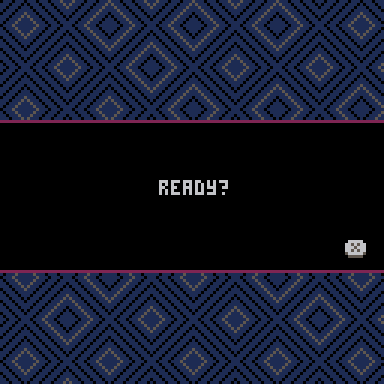
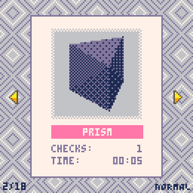

# Hidden Shapes

Source code for Hidden Shapes, a puzzle game made in [PICO-8](https://www.lexaloffle.com/pico-8.php).

Playable on [itch.io](https://vteromero.itch.io/hidden-shapes) and [Lexaloffle BBS](https://www.lexaloffle.com/bbs/?tid=53794).

### License

[CC BY-NC-SA 4.0](https://creativecommons.org/licenses/by-nc-sa/4.0/)
